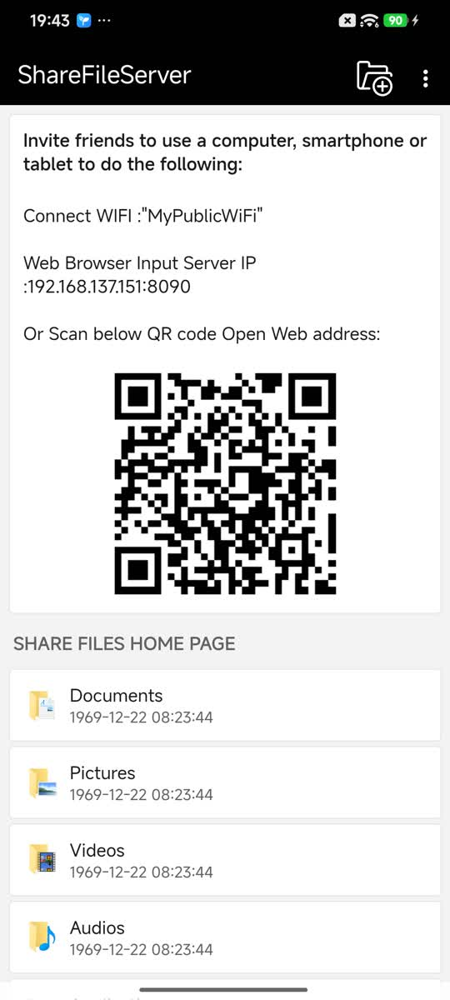
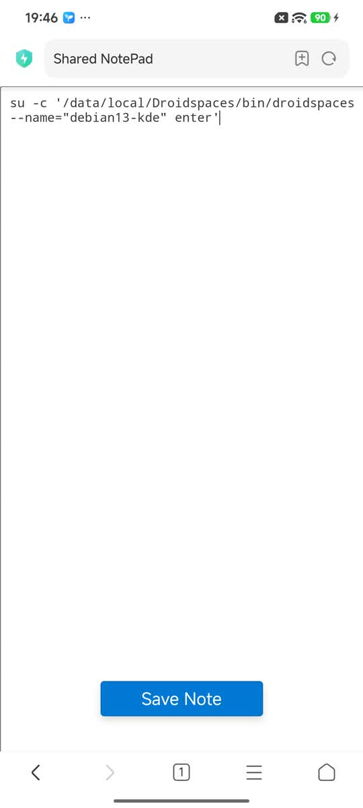
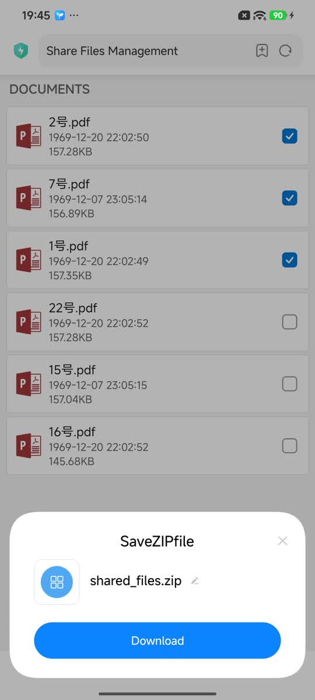
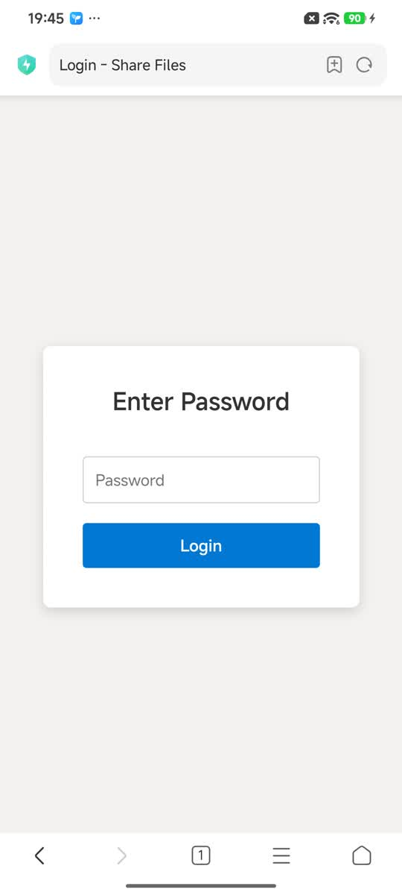
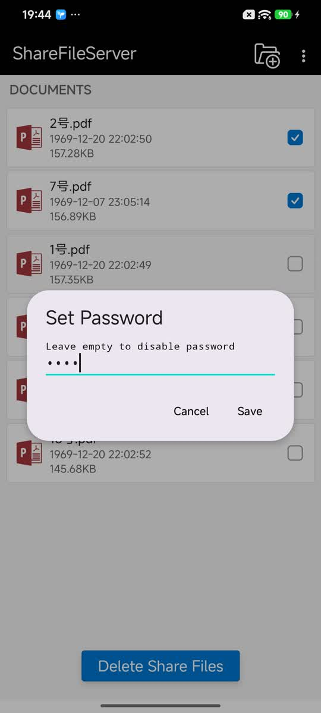
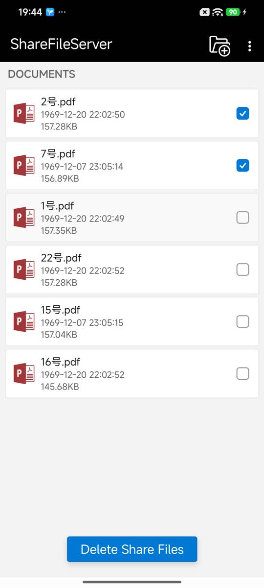
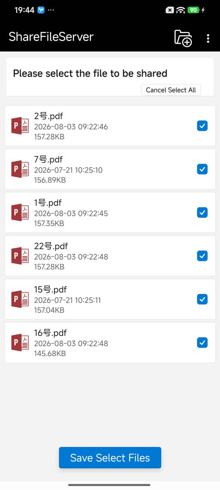
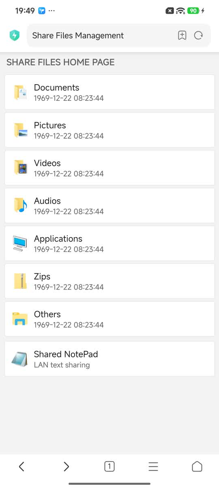

# ShareFileServer - Android本地网络文件共享服务器

[English Version](#english-version)

## 项目概述

ShareFileServer 是一个Android应用程序，允许用户在本地网络中通过Web界面共享文件。该应用在Android设备上运行一个HTTP服务器，其他设备可以通过浏览器访问并下载共享的文件。

## 主要功能

### 1. 文件共享
- 通过Web界面在本地网络中共享文件
- 支持多种文件类型：图片、视频、文档、音频、应用程序、压缩文件等
- 自动分类显示文件
- 支持文件下载和在线预览
- 支持多文件及文件夹批量打包下载（ZIP格式）

### 2. 共享记事本
- 局域网内文本共享功能
- 实时编辑和保存文本内容
- 支持多语言界面（中文/英文）

### 3. 双服务器架构
- **管理服务器** (端口8080)：提供管理界面
- **用户服务器** (端口8090)：提供文件共享界面
- 自动获取设备IP地址并生成访问链接

### 4. 权限管理与安全保障
- Web端访问密码保护，可在App设置中配置
- 文件访问权限控制
- 基于SHA256的认证机制
- 2小时有效期的访问令牌

### 5. 用户界面
- 响应式Web界面，适配移动设备
- 文件分类浏览
- 文件信息显示（文件名、创建时间、文件大小）
- 支持文件搜索

## 技术架构

### 核心组件
1. **Android Service** (`ServerRunService`)
   - 后台运行HTTP服务器
   - 前台服务通知确保服务持续运行
   - 双端口服务器管理

2. **Web服务器引擎**
   - 基于NanoHTTPD的轻量级HTTP服务器
   - JavaScript执行引擎 (js-evaluator-for-android)
   - SQLite数据库存储文件元数据

3. **Web界面**
   - HTML5 + CSS3 + JavaScript
   - jQuery简化DOM操作
   - 响应式设计适配各种屏幕

### 依赖库
- `androidx.core:core-ktx:1.19.0`
- `androidx.appcompat:appcompat:1.7.1`
- `com.google.android.material:material:1.14.0`
- `androidx.activity:activity-ktx:1.13.0`
- **NanoHTTPD** - 轻量级HTTP服务器 (源码集成)
- **js-evaluator-for-android** - JavaScript执行引擎 (源码集成)

## 项目结构

```text
app/src/main/
├── java/
│   ├── com/evgenii/jsevaluator/   # 源码集成的 JS Evaluator
│   ├── fi/iki/elonen/             # 源码集成的 NanoHTTPD
│   └── com/xlzhen/sharefileserver/
│       ├── MainActivity.kt            # 主界面，WebView容器
│       ├── Application.kt             # 应用全局配置
│       ├── service/
│       │   ├── ServerRunService.kt    # 服务器服务
│       │   └── BaseService.kt         # 服务基类
│   ├── server/
│   │   ├── MiniJsServer.kt        # JavaScript服务器
│   │   └── ServerJS.kt            # 服务器JavaScript引擎
│   └── utils/
│       ├── NetWorkUtils.kt        # 网络工具
│       ├── ShareFileToMeUtils.kt  # 文件共享工具
│       ├── ContentUriUtil.kt      # Content URI处理
│       └── DatabaseHelper.kt      # 数据库工具类
├── assets/
│   ├── management/                # 管理界面 (端口8080)
│   │   ├── index.html
│   │   ├── server.js
│   │   └── package.json
│   └── web/                       # 用户界面 (端口8090)
│       ├── index.html
│       ├── login.html             # 访问登录页
│       ├── server.js
│       ├── sharednote.html        # 共享记事本
│       └── video.html             # 视频播放页面
└── res/
    └── values/strings.xml         # 多语言字符串
```

## 使用说明

### 安装与运行
1. 克隆项目到本地
2. 使用Android Studio打开项目
3. 连接Android设备或使用模拟器
4. 构建并运行应用

### 使用方法
1. **启动应用**
   - 应用启动后自动运行HTTP服务器
   - 在通知栏显示服务运行状态

2. **添加共享文件**
   - 点击右上角菜单的"添加文件"按钮
   - 选择要共享的文件（支持多选）
   - 文件将自动添加到共享列表

3. **访问共享文件**
   - 在同一局域网内的其他设备上打开浏览器
   - 访问显示的URL地址（如：http://192.168.1.100:8090）
   - 浏览和下载共享的文件

4. **使用共享记事本**
   - 访问共享记事本页面
   - 实时编辑文本内容
   - 自动保存到服务器

### 权限要求
- `READ_EXTERNAL_STORAGE` - 读取外部存储
- `ACCESS_FINE_LOCATION` - 获取WiFi名称（Android 10+要求）
- `INTERNET` - 网络访问
- `FOREGROUND_SERVICE` & `FOREGROUND_SERVICE_DATA_SYNC` - 前台服务及数据同步
- `NEARBY_WIFI_DEVICES` - 附近WiFi设备访问 (Android 12+)
- `MANAGE_EXTERNAL_STORAGE` - 管理外部存储（Android 11+）

## 开发指南

### 构建配置
- 最低SDK版本：23 (Android 6.0)
- 目标SDK版本：37
- 编译SDK版本：37
- Java版本：11

### 自定义开发
1. **修改Web界面**
   - 编辑`assets/web/`目录下的HTML/CSS/JS文件
   - 修改`server.js`调整服务器逻辑

2. **添加新功能**
   - 在`ServerRunService`中添加新的服务器端点
   - 在Web界面中添加对应的页面和逻辑

3. **国际化**
   - 修改`strings.xml`资源文件
   - 在JavaScript中添加多语言支持

## 安全特性

1. **访问控制**
   - 每个文件生成唯一的访问令牌
   - 令牌2小时后自动失效
   - 防止未授权访问

2. **文件保护**
   - 不直接暴露文件系统路径
   - 通过Content URI安全访问文件
   - 权限验证机制

## 性能优化

1. **内存管理**
   - 使用WebView加载本地HTML资源
   - 异步文件处理避免UI阻塞
   - 数据库索引优化查询性能

2. **网络优化**
   - 本地网络传输，无需互联网
   - 轻量级HTTP服务器减少资源占用
   - 文件分块传输支持大文件

## 故障排除

### 常见问题
1. **无法访问服务器**
   - 检查设备是否在同一WiFi网络
   - 确认防火墙未阻止端口8080/8090
   - 查看应用通知确认服务正常运行

2. **文件无法下载**
   - 检查文件权限设置
   - 确认存储空间充足
   - 验证文件路径是否正确

3. **应用崩溃**
   - 检查Android版本兼容性
   - 确认所有权限已授予
   - 查看Logcat错误日志

### 日志查看
使用Android Studio的Logcat查看应用日志：
```bash
adb logcat -s ShareFileServer
```

## 贡献指南

1. Fork项目
2. 创建功能分支
3. 提交更改
4. 推送到分支
5. 创建Pull Request

## 许可证

本项目基于开源许可证发布。详情请查看LICENSE文件。

## 开源组件致谢

- [NanoHTTPD](https://github.com/NanoHttpd/nanohttpd) - 轻量级HTTP服务器
- [js-evaluator-for-android](https://github.com/evgenyneu/js-evaluator-for-android) - JavaScript执行引擎
- jQuery - JavaScript库

## 预览截图










## 联系方式

- 项目作者：xlzhen <xionglongzhen@gmail.com>
- 项目仓库：https://github.com/xlzhen-940218/ShareFileServer.git

---

**注意**：请确保在合法和授权的情况下使用本应用进行文件共享。尊重他人隐私和版权。

---

<h1 id="english-version">ShareFileServer - Android Local Network File Sharing Server</h1>

[中文版](#sharefileserver---android本地网络文件共享服务器)

## Project Overview

ShareFileServer is an Android application that allows users to share files over a local network through a web interface. The app runs an HTTP server on an Android device, enabling other devices to access and download shared files via a web browser.

## Main Features

### 1. File Sharing
- Share files over local network via web interface
- Supports multiple file types: images, videos, documents, audio, applications, compressed files, etc.
- Automatically categorizes and displays files
- Supports file download and online preview
- Supports batch downloading of multiple files and folders as a ZIP archive

### 2. Shared Notepad
- LAN text sharing functionality
- Real-time editing and saving of text content
- Supports multilingual interface (Chinese/English)

### 3. Dual Server Architecture
- **Management Server** (Port 8080): Provides management interface
- **User Server** (Port 8090): Provides file sharing interface
- Automatically obtains device IP address and generates access links

### 4. Permission Management & Security
- Web access password protection, configurable in App settings
- File access permission control
- SHA256-based authentication mechanism
- 2-hour validity access tokens

### 5. User Interface
- Responsive web interface, optimized for mobile devices
- File categorization browsing
- File information display (filename, creation time, file size)
- Supports file search

## Technical Architecture

### Core Components
1. **Android Service** (`ServerRunService`)
   - Runs HTTP server in background
   - Foreground service notification ensures continuous operation
   - Dual-port server management

2. **Web Server Engine**
   - Lightweight HTTP server based on NanoHTTPD
   - JavaScript execution engine (js-evaluator-for-android)
   - SQLite database for file metadata storage

3. **Web Interface**
   - HTML5 + CSS3 + JavaScript
   - jQuery simplifies DOM operations
   - Responsive design adapts to various screens

### Dependencies
- `androidx.core:core-ktx:1.19.0`
- `androidx.appcompat:appcompat:1.7.1`
- `com.google.android.material:material:1.14.0`
- `androidx.activity:activity-ktx:1.13.0`
- **NanoHTTPD** - Lightweight HTTP server (Source-integrated)
- **js-evaluator-for-android** - JavaScript execution engine (Source-integrated)

## Project Structure

```text
app/src/main/
├── java/
│   ├── com/evgenii/jsevaluator/   # Source-integrated JS Evaluator
│   ├── fi/iki/elonen/             # Source-integrated NanoHTTPD
│   └── com/xlzhen/sharefileserver/
│       ├── MainActivity.kt            # Main interface, WebView container
│       ├── Application.kt             # Application global configuration
│       ├── service/
│       │   ├── ServerRunService.kt    # Server service
│       │   └── BaseService.kt         # Service base class
│   ├── server/
│   │   ├── MiniJsServer.kt        # JavaScript server
│   │   └── ServerJS.kt            # Server JavaScript engine
│   └── utils/
│       ├── NetWorkUtils.kt        # Network utilities
│       ├── ShareFileToMeUtils.kt  # File sharing utilities
│       ├── ContentUriUtil.kt      # Content URI processing
│       └── DatabaseHelper.kt      # Database helper
├── assets/
│   ├── management/                # Management interface (Port 8080)
│   │   ├── index.html
│   │   ├── server.js
│   │   └── package.json
│   └── web/                       # User interface (Port 8090)
│       ├── index.html
│       ├── login.html             # Login page
│       ├── server.js
│       ├── sharednote.html        # Shared notepad
│       └── video.html             # Video playback page
└── res/
    └── values/strings.xml         # Multilingual strings
```

## Usage Instructions

### Installation and Running
1. Clone the project locally
2. Open the project with Android Studio
3. Connect Android device or use emulator
4. Build and run the application

### How to Use
1. **Start the Application**
   - HTTP server automatically starts when app launches
   - Service status displayed in notification bar

2. **Add Shared Files**
   - Click "Add Files" button in top-right menu
   - Select files to share (multiple selection supported)
   - Files automatically added to sharing list

3. **Access Shared Files**
   - Open browser on other devices in same LAN
   - Access displayed URL (e.g., http://192.168.1.100:8090)
   - Browse and download shared files

4. **Use Shared Notepad**
   - Access shared notepad page
   - Edit text content in real-time
   - Automatically saved to server

### Permission Requirements
- `READ_EXTERNAL_STORAGE` - Read external storage
- `ACCESS_FINE_LOCATION` - Get WiFi name (Android 10+ requirement)
- `INTERNET` - Internet access
- `FOREGROUND_SERVICE` & `FOREGROUND_SERVICE_DATA_SYNC` - Foreground service and data sync
- `NEARBY_WIFI_DEVICES` - Nearby WiFi devices access (Android 12+)
- `MANAGE_EXTERNAL_STORAGE` - Manage external storage (Android 11+)

## Development Guide

### Build Configuration
- Min SDK Version: 23 (Android 6.0)
- Target SDK Version: 37
- Compile SDK Version: 37
- Java Version: 11

### Custom Development
1. **Modify Web Interface**
   - Edit HTML/CSS/JS files in `assets/web/` directory
   - Modify `server.js` to adjust server logic

2. **Add New Features**
   - Add new server endpoints in `ServerRunService`
   - Add corresponding pages and logic in web interface

3. **Internationalization**
   - Modify `strings.xml` resource file
   - Add multilingual support in JavaScript

## Security Features

1. **Access Control**
   - Unique access token generated for each file
   - Tokens automatically expire after 2 hours
   - Prevents unauthorized access

2. **File Protection**
   - Does not directly expose file system paths
   - Secure file access through Content URI
   - Permission verification mechanism

## Performance Optimization

1. **Memory Management**
   - Uses WebView to load local HTML resources
   - Asynchronous file processing avoids UI blocking
   - Database indexing optimizes query performance

2. **Network Optimization**
   - Local network transmission, no internet required
   - Lightweight HTTP server reduces resource usage
   - Chunked file transfer supports large files

## Troubleshooting

### Common Issues
1. **Cannot Access Server**
   - Check if devices are on same WiFi network
   - Confirm firewall is not blocking ports 8080/8090
   - Check app notification to confirm service is running normally

2. **Files Cannot Be Downloaded**
   - Check file permission settings
   - Confirm sufficient storage space
   - Verify file path is correct

3. **App Crashes**
   - Check Android version compatibility
   - Confirm all permissions are granted
   - Check Logcat error logs

### Log Viewing
Use Android Studio Logcat to view app logs:
```bash
adb logcat -s ShareFileServer
```

## Contribution Guidelines

1. Fork the project
2. Create a feature branch
3. Commit changes
4. Push to the branch
5. Create a Pull Request

## License

This project is released under an open source license. Please see the LICENSE file for details.

## Open Source Components Acknowledgments

- [NanoHTTPD](https://github.com/NanoHttpd/nanohttpd) - Lightweight HTTP server
- [js-evaluator-for-android](https://github.com/evgenyneu/js-evaluator-for-android) - JavaScript execution engine
- jQuery - JavaScript library

## Preview Screenshots


## Contact Information

- Project Author: xlzhen <xionglongzhen@gmail.com>
- Project Repository: https://github.com/xlzhen-940218/ShareFileServer.git

---

**Note**: Please ensure you use this application for file sharing in legal and authorized situations. Respect others' privacy and copyright.