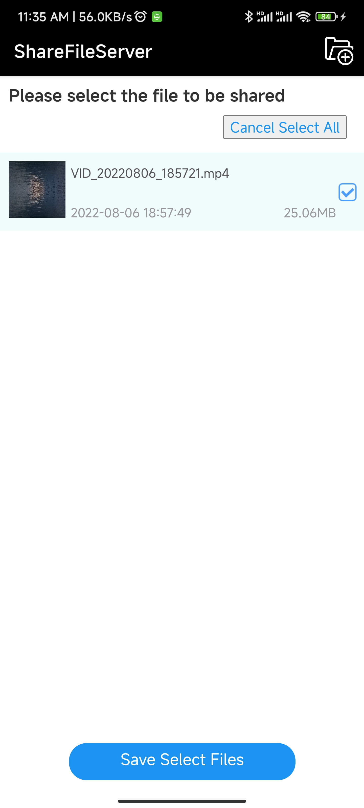
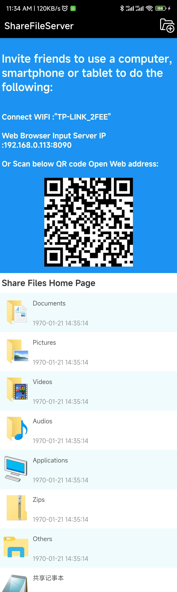

# ShareFileServer - Android本地网络文件共享服务器
# ShareFileServer - Android Local Network File Sharing Server

## 项目概述 / Project Overview

ShareFileServer 是一个Android应用程序，允许用户在本地网络中通过Web界面共享文件。该应用在Android设备上运行一个HTTP服务器，其他设备可以通过浏览器访问并下载共享的文件。

ShareFileServer is an Android application that allows users to share files over a local network through a web interface. The app runs an HTTP server on an Android device, enabling other devices to access and download shared files via a web browser.

## 主要功能 / Main Features

### 1. 文件共享 / File Sharing
- 通过Web界面在本地网络中共享文件 / Share files over local network via web interface
- 支持多种文件类型：图片、视频、文档、音频、应用程序、压缩文件等 / Supports multiple file types: images, videos, documents, audio, applications, compressed files, etc.
- 自动分类显示文件 / Automatically categorizes and displays files
- 支持文件下载和在线预览 / Supports file download and online preview

### 2. 共享记事本 / Shared Notepad
- 局域网内文本共享功能 / LAN text sharing functionality
- 实时编辑和保存文本内容 / Real-time editing and saving of text content
- 支持多语言界面（中文/英文） / Supports multilingual interface (Chinese/English)

### 3. 双服务器架构 / Dual Server Architecture
- **管理服务器** (端口8080)：提供管理界面 / **Management Server** (Port 8080): Provides management interface
- **用户服务器** (端口8090)：提供文件共享界面 / **User Server** (Port 8090): Provides file sharing interface
- 自动获取设备IP地址并生成访问链接 / Automatically obtains device IP address and generates access links

### 4. 权限管理 / Permission Management
- 文件访问权限控制 / File access permission control
- 基于SHA256的认证机制 / SHA256-based authentication mechanism
- 2小时有效期的访问令牌 / 2-hour validity access tokens

### 5. 用户界面 / User Interface
- 响应式Web界面，适配移动设备 / Responsive web interface, optimized for mobile devices
- 文件分类浏览 / File categorization browsing
- 文件信息显示（文件名、创建时间、文件大小） / File information display (filename, creation time, file size)
- 支持文件搜索 / Supports file search

## 技术架构 / Technical Architecture

### 核心组件 / Core Components
1. **Android Service** (`ServerRunService`)
   - 后台运行HTTP服务器 / Runs HTTP server in background
   - 前台服务通知确保服务持续运行 / Foreground service notification ensures continuous operation
   - 双端口服务器管理 / Dual-port server management

2. **Web服务器引擎** / **Web Server Engine**
   - 基于NanoHTTPD的轻量级HTTP服务器 / Lightweight HTTP server based on NanoHTTPD
   - JavaScript执行引擎 (js-evaluator-for-android) / JavaScript execution engine (js-evaluator-for-android)
   - SQLite数据库存储文件元数据 / SQLite database for file metadata storage

3. **Web界面** / **Web Interface**
   - HTML5 + CSS3 + JavaScript
   - jQuery简化DOM操作 / jQuery simplifies DOM operations
   - 响应式设计适配各种屏幕 / Responsive design adapts to various screens

### 依赖库 / Dependencies
- `androidx.appcompat:appcompat:1.5.0`
- `com.google.android.material:material:1.6.1`
- `NanoHTTPD/nanohttpd` - 轻量级HTTP服务器 / Lightweight HTTP server
- `evgenyneu/js-evaluator-for-android` - JavaScript执行引擎 / JavaScript execution engine

## 项目结构 / Project Structure

```
app/src/main/
├── java/com/xlzhen/sharefileserver/
│   ├── MainActivity.java          # 主界面，WebView容器 / Main interface, WebView container
│   ├── Application.java           # 应用全局配置 / Application global configuration
│   ├── service/
│   │   ├── ServerRunService.java  # 服务器服务 / Server service
│   │   └── BaseService.java       # 服务基类 / Service base class
│   ├── server/
│   │   ├── MiniJsServer.java      # JavaScript服务器 / JavaScript server
│   │   └── ServerJS.java          # 服务器JavaScript引擎 / Server JavaScript engine
│   └── utils/
│       ├── NetWorkUtils.java      # 网络工具 / Network utilities
│       ├── ShareFileToMeUtils.java # 文件共享工具 / File sharing utilities
│       └── ContentUriUtil.java    # Content URI处理 / Content URI processing
├── assets/
│   ├── management/                # 管理界面 (端口8080) / Management interface (Port 8080)
│   │   ├── index.html
│   │   ├── server.js
│   │   └── package.json
│   └── web/                       # 用户界面 (端口8090) / User interface (Port 8090)
│       ├── index.html
│       ├── server.js
│       ├── sharednote.html        # 共享记事本 / Shared notepad
│       └── video.html             # 视频播放页面 / Video playback page
└── res/
    └── values/strings.xml         # 多语言字符串 / Multilingual strings
```

## 使用说明 / Usage Instructions

### 安装与运行 / Installation and Running
1. 克隆项目到本地 / Clone the project locally
2. 使用Android Studio打开项目 / Open the project with Android Studio
3. 连接Android设备或使用模拟器 / Connect Android device or use emulator
4. 构建并运行应用 / Build and run the application

### 使用方法 / How to Use
1. **启动应用** / **Start the Application**
   - 应用启动后自动运行HTTP服务器 / HTTP server automatically starts when app launches
   - 在通知栏显示服务运行状态 / Service status displayed in notification bar

2. **添加共享文件** / **Add Shared Files**
   - 点击右上角菜单的"添加文件"按钮 / Click "Add Files" button in top-right menu
   - 选择要共享的文件（支持多选） / Select files to share (multiple selection supported)
   - 文件将自动添加到共享列表 / Files automatically added to sharing list

3. **访问共享文件** / **Access Shared Files**
   - 在同一局域网内的其他设备上打开浏览器 / Open browser on other devices in same LAN
   - 访问显示的URL地址（如：http://192.168.1.100:8090） / Access displayed URL (e.g., http://192.168.1.100:8090)
   - 浏览和下载共享的文件 / Browse and download shared files

4. **使用共享记事本** / **Use Shared Notepad**
   - 访问共享记事本页面 / Access shared notepad page
   - 实时编辑文本内容 / Edit text content in real-time
   - 自动保存到服务器 / Automatically saved to server

### 权限要求 / Permission Requirements
- `READ_EXTERNAL_STORAGE` - 读取外部存储 / Read external storage
- `ACCESS_FINE_LOCATION` - 获取WiFi名称（Android 10+要求） / Get WiFi name (Android 10+ requirement)
- `INTERNET` - 网络访问 / Internet access
- `FOREGROUND_SERVICE` - 前台服务 / Foreground service
- `MANAGE_EXTERNAL_STORAGE` - 管理外部存储（Android 11+） / Manage external storage (Android 11+)

## 开发指南 / Development Guide

### 构建配置 / Build Configuration
- 最低SDK版本：21 (Android 5.0) / Min SDK Version: 21 (Android 5.0)
- 目标SDK版本：32 (Android 12L) / Target SDK Version: 32 (Android 12L)
- 编译SDK版本：36 / Compile SDK Version: 36
- Java版本：11 / Java Version: 11

### 自定义开发 / Custom Development
1. **修改Web界面** / **Modify Web Interface**
   - 编辑`assets/web/`目录下的HTML/CSS/JS文件 / Edit HTML/CSS/JS files in `assets/web/` directory
   - 修改`server.js`调整服务器逻辑 / Modify `server.js` to adjust server logic

2. **添加新功能** / **Add New Features**
   - 在`ServerRunService`中添加新的服务器端点 / Add new server endpoints in `ServerRunService`
   - 在Web界面中添加对应的页面和逻辑 / Add corresponding pages and logic in web interface

3. **国际化** / **Internationalization**
   - 修改`strings.xml`资源文件 / Modify `strings.xml` resource file
   - 在JavaScript中添加多语言支持 / Add multilingual support in JavaScript

## 安全特性 / Security Features

1. **访问控制** / **Access Control**
   - 每个文件生成唯一的访问令牌 / Unique access token generated for each file
   - 令牌2小时后自动失效 / Tokens automatically expire after 2 hours
   - 防止未授权访问 / Prevents unauthorized access

2. **文件保护** / **File Protection**
   - 不直接暴露文件系统路径 / Does not directly expose file system paths
   - 通过Content URI安全访问文件 / Secure file access through Content URI
   - 权限验证机制 / Permission verification mechanism

## 性能优化 / Performance Optimization

1. **内存管理** / **Memory Management**
   - 使用WebView加载本地HTML资源 / Uses WebView to load local HTML resources
   - 异步文件处理避免UI阻塞 / Asynchronous file processing avoids UI blocking
   - 数据库索引优化查询性能 / Database indexing optimizes query performance

2. **网络优化** / **Network Optimization**
   - 本地网络传输，无需互联网 / Local network transmission, no internet required
   - 轻量级HTTP服务器减少资源占用 / Lightweight HTTP server reduces resource usage
   - 文件分块传输支持大文件 / Chunked file transfer supports large files

## 故障排除 / Troubleshooting

### 常见问题 / Common Issues
1. **无法访问服务器** / **Cannot Access Server**
   - 检查设备是否在同一WiFi网络 / Check if devices are on same WiFi network
   - 确认防火墙未阻止端口8080/8090 / Confirm firewall is not blocking ports 8080/8090
   - 查看应用通知确认服务正常运行 / Check app notification to confirm service is running normally

2. **文件无法下载** / **Files Cannot Be Downloaded**
   - 检查文件权限设置 / Check file permission settings
   - 确认存储空间充足 / Confirm sufficient storage space
   - 验证文件路径是否正确 / Verify file path is correct

3. **应用崩溃** / **App Crashes**
   - 检查Android版本兼容性 / Check Android version compatibility
   - 确认所有权限已授予 / Confirm all permissions are granted
   - 查看Logcat错误日志 / Check Logcat error logs

### 日志查看 / Log Viewing
使用Android Studio的Logcat查看应用日志 / Use Android Studio Logcat to view app logs:
```bash
adb logcat -s ShareFileServer
```

## 贡献指南 / Contribution Guidelines

1. Fork项目 / Fork the project
2. 创建功能分支 / Create a feature branch
3. 提交更改 / Commit changes
4. 推送到分支 / Push to the branch
5. 创建Pull Request / Create a Pull Request

## 许可证 / License

本项目基于开源许可证发布。详情请查看LICENSE文件。

This project is released under an open source license. Please see the LICENSE file for details.

## 开源组件致谢 / Open Source Components Acknowledgments

- [NanoHTTPD](https://github.com/NanoHttpd/nanohttpd) - 轻量级HTTP服务器 / Lightweight HTTP server
- [js-evaluator-for-android](https://github.com/evgenyneu/js-evaluator-for-android) - JavaScript执行引擎 / JavaScript execution engine
- jQuery - JavaScript库 / JavaScript library

## 预览截图 / Preview Screenshots





## 联系方式 / Contact Information

- 项目作者：xlzhen <xionglongzhen@gmail.com> / Project Author: xlzhen <xionglongzhen@gmail.com>
- 项目仓库：https://github.com/xlzhen-940218/ShareFileServer.git / Project Repository: https://github.com/xlzhen-940218/ShareFileServer.git

---

**注意**：请确保在合法和授权的情况下使用本应用进行文件共享。尊重他人隐私和版权。

**Note**: Please ensure you use this application for file sharing in legal and authorized situations. Respect others' privacy and copyright.